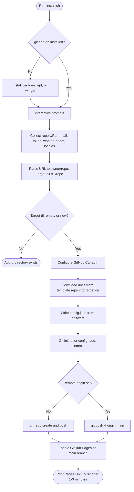

# MCGI Zoom Meeting Generator

A mobile-first Vue app that generates personalized Zoom meeting links with properly formatted display names.

## Features

- Mobile-first responsive design
- Step-by-step one-question-at-a-time flow
- English and Tagalog locale support
- LocalStorage form persistence
- One-click copy and join functionality

## One-Command Installer

Use the installer to generate and publish a ready-to-use Zoom page repository.

Installer script: [https://github.com/mcgicolo/zoom-link](https://github.com/mcgicolo/zoom-link)

### macOS / Linux

```bash
curl -fsSL https://raw.githubusercontent.com/mcgicolo/zoom-link/main/install.sh | bash
```

### Windows (PowerShell)

```powershell
irm https://raw.githubusercontent.com/mcgicolo/zoom-link/main/install.ps1 | iex
```

### Windows (Git Bash)

```bash
curl -fsSL https://raw.githubusercontent.com/mcgicolo/zoom-link/main/install.sh | bash
```

The installer will ask for:

- GitHub repo URL (example: `https://github.com/OWNER/REPO`)
- GitHub email
- GitHub pass/token
- Worker's name
- Worker's phone
- Zoom ID
- Zoom pass
- Allowed locales (press Enter to use defaults)

It then:

- downloads `docs/` into a local folder named after the repo
- creates `config.json` from your answers
- pushes to your target GitHub repo
- enables GitHub Pages and prints the URL

### How the installer works



## Development

```bash
npm install
npm run dev
```

## Build

```bash
npm run build
```

Build output is generated in `docs/`.

## Configuration

To use this with your own Zoom meeting, update the `ZOOM_CONFIG` object in `src/App.vue`.

## GitHub Pages Deployment

You can deploy the generated `dist/` files to GitHub Pages (for example using `gh-pages` branch or `docs/` folder flow).
